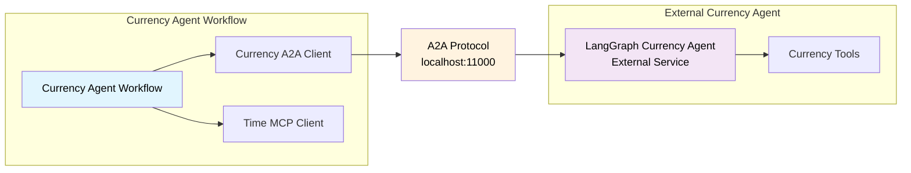

<!--
SPDX-FileCopyrightText: Copyright (c) 2025-2026, NVIDIA CORPORATION & AFFILIATES. All rights reserved.
SPDX-License-Identifier: Apache-2.0

Licensed under the Apache License, Version 2.0 (the "License");
you may not use this file except in compliance with the License.
You may obtain a copy of the License at

http://www.apache.org/licenses/LICENSE-2.0

Unless required by applicable law or agreed to in writing, software
distributed under the License is distributed on an "AS IS" BASIS,
WITHOUT WARRANTIES OR CONDITIONS OF ANY KIND, either express or implied.
See the License for the specific language governing permissions and
limitations under the License.
-->

# Currency Agent A2A Example

**Complexity:** Beginner

This is a snapshot of the NVIDIA NeMo Agent Toolkit 1.6 `currency_agent_a2a` example. It demonstrates a toolkit workflow connecting to a third-party A2A server, the LangGraph-based currency agent. The workflow acts as an A2A client to perform currency conversions and financial queries with time-based context.

This example is intentionally hosted in the examples repository because it depends on external services and a separately cloned A2A sample server. It is useful as a reference integration, but it is not intended to be a deterministic release-validation example for the toolkit itself.

## Key Features

- Per-user A2A client connections to external services
- External A2A integration with a third-party LangGraph currency agent
- Hybrid tool architecture combining A2A currency tools with MCP time services
- Currency conversion with historical date context
- Multi-user support through isolated session state

## Architecture Overview



## Installation and Setup

### Prerequisites

Clone this repository and create the development environment described in the root [README](../../README.md).

### Set Up API Keys

Set your NVIDIA and OpenAI API keys as environment variables:

```bash
export NVIDIA_API_KEY=<YOUR_API_KEY>
export OPENAI_API_KEY=<YOUR_API_KEY>
```

### Set Up External A2A Server

The currency agent runs as an external service using the `a2a-samples` repository:

```bash
# Step 1: Clone the a2a-samples repository and checkout the tested revision.
mkdir -p external
cd external
git clone https://github.com/a2aproject/a2a-samples.git
cd a2a-samples
git checkout eb3885f

# Step 2: Navigate to the LangGraph agent.
cd samples/python/agents/langgraph

# Step 3: Set the environment variables for the currency agent.
cat <<EOF > .env
API_KEY=$OPENAI_API_KEY
model_source=openai
TOOL_LLM_URL=https://api.openai.com/v1
TOOL_LLM_NAME=gpt-4o-mini
EOF

# Step 4: Run the currency agent on port 11000.
uv run app --port 11000
```

### Install Currency Agent Client

From the root directory of this repository, install this example:

```bash
uv pip install -e examples/currency_agent_a2a
```

## Usage

### Verify External Server

First, verify the external currency agent is running:

```bash
nat a2a client discover --url http://localhost:11000
```

### Run the Currency Agent Client

In a separate terminal, run the client workflow:

```bash
nat run --config_file examples/currency_agent_a2a/configs/config.yml \
  --input "What is 100 USD in EUR?"
```

### Additional Examples

For historical and time-integrated prompts, see [`data/sample_queries.json`](data/sample_queries.json). Those prompts depend on the external currency agent and live currency API behavior.

## Per-User Workflow Architecture

This example uses a per-user workflow pattern because A2A clients are per-user function groups:

- Each user gets isolated connections to the external A2A service
- Independent session state and request tracking per user

## Configuration Details

### Workflow Configuration

The workflow is configured to use the core per-user ReAct agent:

```yaml
workflow:
  _type: per_user_react_agent
  tool_names:
    - mcp_date_time__get_current_time_mcp_tool
    - currency_agent
  llm_name: nim_llm
```

### Tool Composition

The configuration demonstrates two types of tool integration:

1. A2A client tools through `currency_agent`
2. MCP client tools through `mcp_date_time`

## Troubleshooting

### Connection Issues

If the external server is not running, check the agent discovery card:

```bash
curl http://localhost:11000/.well-known/agent-card.json | jq
```

### Port Conflicts

Ensure port `11000` is available for the currency agent. If needed, modify the port in both the external agent startup command and `configs/config.yml`.

### Timeouts

If queries take longer than expected, increase `task_timeout` in the A2A client configuration and check network connectivity to the external service.

## Related Examples

For deterministic A2A release validation examples owned by the toolkit, use the `math_assistant_a2a` and `math_assistant_a2a_protected` examples in the toolkit repository.
